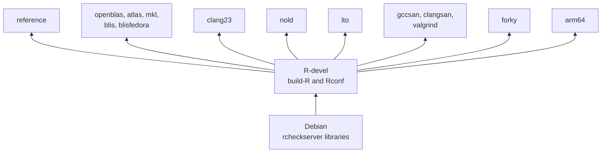
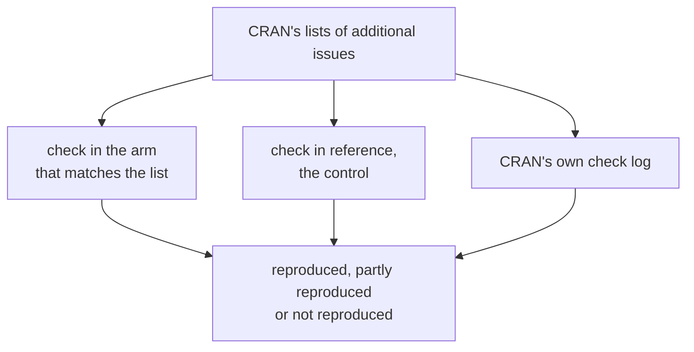
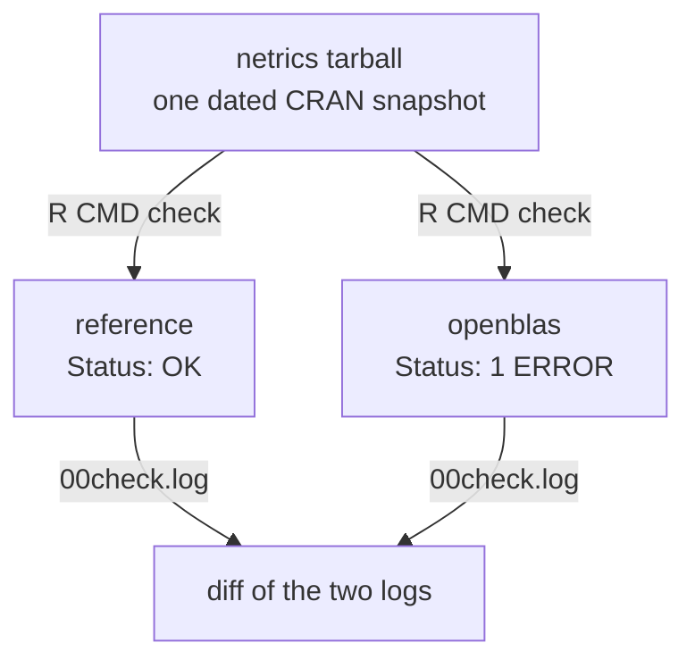

# r-check-containers

These containers rerun several of CRAN's additional checks on your own
machine, among them the BLAS, clang 23, noLD, LTO, sanitizer, valgrind and
donttest checks, on x86 and on arm64.

Each image is called an *arm*. An arm is R-devel built with `build-R` and
`Rconf` from the [CRAN QA tree][qa-tree], on a Debian base that gets its
system libraries from AASC's [`rcheckserver`][aasc]. An arm differs from the
`reference` arm in the BLAS, the compilers, a configure option, the Debian
release or the CPU architecture, so a difference in a check result can be
traced to that change.

This is a fork of Simon Urbanek's [docker-r-check][docker-r-check]. His
build-and-mount workflow, described in [README](README), works as before. The
fork adds the arms, a `standalone` image with R built in, the scripts in
`demo/`, and a workflow that compares the arms with CRAN's own results.

## Quick start

These three lines pull two published arms and check one package in both. You
need Docker and about 60 GB of free disk, on x86_64 Linux or an Apple Silicon
Mac.

```sh
git clone -b debian-blas-arms https://github.com/coatless/docker-r-check && cd docker-r-check
demo/01-pull.sh reference openblas
OPENBLAS_CORETYPE=Haswell demo/04-compare.sh "reference openblas" netrics
```

`netrics` 1.1.0 was on CRAN's OpenBLAS list on 2026-10-09. It passes in
`reference` and fails one test in `openblas`, the same test as at CRAN.

```
netrics
  reference    OK                           mode=regular
  openblas     1 ERROR                      mode=regular  openblas-core=Haswell
  reference vs openblas: 00check.log differs
```

On a four-core Linux machine the pull took 10 minutes and the comparison 94.
Nearly all of that went into installing the 73 packages `netrics` needs, from
source, once in each arm.

## Arms

All arms share one R build recipe.



There are fourteen arms. Each one changes a single thing against `reference`,
except `blisfedora`, which also needs a newer Debian for its BLIS.

| Arm | What it changes | Passed to `Rconf` |
|---|---|---|
| `reference` | Nothing. R's own BLAS and LAPACK, GCC 14, Debian trixie. | `-bi` |
| `openblas` | Serial OpenBLAS 0.3.29, with its LAPACK 3.12.0 | `-bo` |
| `atlas` | ATLAS 3.10.3, with its LAPACK 3.11.0 | `--with-blas=-lblas --with-lapack=-llapack` |
| `mkl` | Serial Intel MKL 2026.1, BLAS and LAPACK | `-bm` |
| `blis` | Serial BLIS 2.1, with Debian's LAPACK 3.12.1 | `--with-blas=-lblas --with-lapack=-llapack` |
| `blisfedora` | The BLIS binary from Fedora's `blis-2.0-5` package, which is the one CRAN uses, on Debian forky | `--with-blas=-lblas --with-lapack=-llapack` |
| `clang23` | clang 23 and flang 23, with libc++ | `-fc/23 -bi` |
| `nold` | R built without long double | `-bi --disable-long-double` |
| `lto` | R and every package it installs built with link-time optimization | `-bi --enable-lto` |
| `gccsan` | GCC's address and undefined behavior sanitizers | `-bi -x` |
| `clangsan` | clang 23 with its address and undefined behavior sanitizers | `-fc/23 -bi -x` |
| `valgrind` | R with valgrind instrumentation, and checks run under valgrind | `-bi -v` |
| `forky` | Debian forky, which has glibc 2.43 | `-bi` |
| `arm64` | The arm64 architecture | `-bi` |

`reference` is the control. All fourteen build on GitHub's runners, `arm64`
on an arm64 one and the rest on x86. The first three also build on a Mac
under Rosetta. A build fails unless R reports the BLAS the arm is named for,
so an image cannot carry a different BLAS than its name says. The `lto` build
also fails unless the linker catches a type mismatch planted between two
files.

CRAN's [list of issue kinds][issue-kinds] changes often. Regular ATLAS runs
stopped on 2026-09-01, according to the [notes on the BLAS checks][rblas],
and BLIS joined the list. You can fetch the current list in R.

```r
x <- readRDS(url("https://cran.r-project.org/web/checks/check_issues.rds"))
table(x$kind)
```

## How the arms compare with CRAN

A workflow checks every package on CRAN's current lists in the arm that
matches its list, with `reference` as the control, then compares each result
with CRAN's own log.



A result is reproduced when the arm shows exactly the problems in CRAN's log,
partly reproduced when it shows some of them, and not reproduced when the
arm's check is clean. "Also in reference" means the control shows the same
problem, so the arm's own change is not what causes it. An entry that failed
at CRAN on a web request shows as not reproduced when the request works here.

### The latest run

<!-- daily results, rewritten by the evaluate workflow: start -->
The evaluate workflow repeats this comparison for CRAN's OpenBLAS, MKL, BLIS
and clang23 lists and rewrites this section. It is set to run every day. The
[run of 2026-10-10][daily-run] used R-devel r90659, the CRAN snapshot of
2026-10-09 and CRAN's lists as of 2026-10-10 08:50 GMT.

| CRAN's list | Package | CRAN's result | Result here |
|---|---|---|---|
| OpenBLAS | `ButtR` 1.1.1 | tests testthat.R: ERROR | not reproduced |
| OpenBLAS | `htrSPRanalysis` 0.1.3 | re-building of vignette outputs: ERROR | not reproduced |
| OpenBLAS | `netrics` 1.1.0 | tests testthat.R: ERROR | reproduced |
| OpenBLAS | `stm` 1.3.8 | re-building of vignette outputs: ERROR | not reproduced |
| OpenBLAS | `timeperiodsR` 0.7.7 | re-building of vignette outputs: ERROR | not reproduced |
| MKL | `fastPLS` 0.3 | tests testthat.R: ERROR | reproduced |
| MKL | `spinebil` 1.0.5 | re-building of vignette outputs: ERROR | not reproduced |
| BLIS | `BFS` 0.7.2 | tests testthat.R: ERROR | not reproduced |
| BLIS | `ISwR` 2.0-12 | tests allexercises.Rout: NOTE; tests allscripts.Rout: NOTE | reproduced, part of it also in reference (`blis-fedora-haswell`, `blis-fedora-skx`, `blis-fedora-zen3`, `blis-zen3`)<br>partly reproduced, all of it also in reference (`blis-haswell`) |
| BLIS | `micEconDistRay` 0.1-4 | tests appleProdFr86_test.Rout: NOTE | reproduced (`blis-fedora-haswell`, `blis-fedora-skx`)<br>not reproduced (`blis-fedora-zen3`, `blis-haswell`, `blis-zen3`) |
| BLIS | `spatPomp` 1.1.0 | tests bm.Rout: NOTE; tests measles.Rout: NOTE | partly reproduced, all of it also in reference |
| BLIS | `vaccineff` 1.0.3 | tests testthat.R: ERROR | not reproduced |
| BLIS | `WpProj` 0.3 | tests testthat.R: ERROR | reproduced (`blis-fedora-haswell`, `blis-fedora-zen3`, `blis-haswell`, `blis-zen3`)<br>not reproduced (`blis-fedora-skx`) |
| clang23 | `RecAssoRules` 1.0 | whether package can be installed: ERROR | reproduced |
| clang23 | `timesift` 0.3.1 | whether package can be installed: ERROR | reproduced |

A BLIS entry is checked once for each BLIS build and kernel set. `blis-zen3`
is Debian's BLIS with the zen3 kernels, and `blis-fedora-haswell` is Fedora's
binary with the haswell kernels.

No results came from `blis-skx` this time.

These entries changed since the run of 2026-10-10.

- `BFS` on the BLIS list went from "reproduced, all of it also in reference"
  to "not reproduced" in `blis-haswell`.

[daily-run]: https://github.com/coatless/docker-r-check/actions/runs/38042943254
<!-- daily results: end -->

### Every list, 2026-10-04 to 2026-10-07

Over these four days the workflow went through every list once, 350 entries
in all.

| CRAN's list | Packages | What the arms showed |
|---|---|---|
| OpenBLAS | 5 | Both real failures reproduce, `netrics` and `spCF`, on the same test as at CRAN. The other three failed at CRAN on a web request. |
| MKL | 3 | `fastPLS` segfaults and `OpenSpecy` fails the same test as at CRAN, both in `mkl` and not in `reference`. |
| BLIS | 7 | Three appear with Debian's BLIS and a fourth with Fedora's binary. One was a web failure at CRAN, and two never appear. |
| clang23 | 97 | Three packages fail to compile, with the same compiler error as at CRAN. 83 pass, mostly because `duckdb`, which they need, builds again. |
| noLD | 5 | Three fail their tests in `nold` as at CRAN and pass in `reference`. |
| donttest | 184 | 157 show the failing `\donttest` examples CRAN reports, 134 of them with exactly CRAN's set of problems. These run in `reference` with the examples switched on. |
| Sanitizers and valgrind | 7 | Six show CRAN's error in `gccsan`, `clangsan` or `valgrind`. The seventh is an install warning. |
| arm64 Linux | 42 | 37 show the arm64 failure in `arm64`, 28 of them with exactly CRAN's set of problems. For 29 of the 37, `reference` is clean on x86. |

A check uses the package version that CRAN's log is for. Dependencies come
from a CRAN snapshot one day old, and a package updated since would otherwise
be checked at the version before. That hid both OpenBLAS failures in an
earlier run.

On 2026-10-06 CRAN listed no LTO issues, because the packages that had them
have been archived. Their 30 install logs are still published, so I checked
the `lto` arm against those, with each package taken from CRAN's archive.
Fourteen of the 30 still compile with current R-devel, and all 14 give the
same LTO warnings as CRAN's log. Two of the 14 then fail to load, for
reasons that have nothing to do with LTO. The other 16 stop earlier, on code
that no longer compiles or on dependencies that are gone.

Two more lists ran in the images their own maintainers publish, with nothing
built here. Ten of CRAN's 11 musl failures reproduce in the
[Alpine image][musl] behind those checks. Of the 67 packages on the rchk
list, 45 show some or all of CRAN's findings in [r-hub's][rhub] `rchk` image.

Pushing a branch named `evaluate` starts a run, and `eval/run.env` says which
lists it covers. A full run keeps GitHub's runners busy for several hours.

## Repeating the checks

A run can also repeat its checks under other conditions and compare. On
2026-10-05 five arms repeated 57 package checks three ways, with the R
revision and the CRAN snapshot of the run a day before.

| Repeated | Same result | What differed |
|---|---|---|
| Under rootless Podman, same image | 56 of 57 | One vignette that could not reach a web service |
| With the network cut off | 44 of 57 | Five packages whose examples, tests or vignettes download something |
| A day later, on other runners | 55 of 57 | One download that worked this time, and `irlba` under MKL, which failed on an AMD CPU and had passed on an Intel one |

The checks themselves need no network once the dependencies are installed.

By default the image checks one package at a time with the QA tree's
`check_CRAN_incoming`. With `RCC_RUNNER=dir` it uses the newer
`check-CRAN-incoming` from the same tree, which is built on
`tools::check_packages_in_dir()` and checks several packages at once. On 16
packages in `reference` the two gave the same results. The second took 15
minutes on four cores where the first took 96, dependencies included.

## Demo scripts

The scripts in `demo/` are thin wrappers around `docker build`, `docker pull`
and `docker run`. They run in order, from checking the host to comparing two
arms.

| Script | What it does |
|---|---|
| `00-preflight.sh` | Confirms the engine can run amd64 containers and says whether they run natively, under Rosetta or under QEMU. |
| `01-build.sh <arm>...` | Builds `rcc-standalone:<arm>` with R and the QA tree pinned to fixed SVN revisions. |
| `01-pull.sh <arm>...` | Pulls the published image of each arm in place of building it, and names it `rcc-standalone:<arm>`. `RCC_R_REV` picks the build of one R-devel revision. |
| `02-inspect.sh <arm>...` | Prints what the image recorded at build time and the BLAS and LAPACK that R loads. |
| `03-check.sh <arm> <pkg>...` | Checks CRAN packages or local tarballs through the image's entrypoint. Writes the `.Rcheck` directory and a `manifest.dcf` to `results/<arm>/<pkg>/`. |
| `04-compare.sh "<arms>" <pkg>...` | Runs `03-check.sh` in each arm from one dated snapshot, then diffs every `00check.log` against the first arm's. |

`01-pull.sh` pulls the [published images][images], about 9 GB each. To build
an arm yourself, run `01-build.sh` in its place. With
`R_SVN_REV=90653 QA_SVN_REV=6968` in front, it builds the R-devel revision the
published images have. A build also needs BuildKit and 8 GB of engine memory.

`04-compare.sh` checks one tarball in each arm, with dependencies from one
dated CRAN snapshot, and diffs the logs.



For `netrics` in the quick start, the diff shows the failing test. The lines
in between are left out here.

```
  reference vs openblas: 00check.log differs
    50c50
    < * checking tests ... OK
    ---
    > * checking tests ... ERROR
    [...]
    >   ── Failure ('test-measure_cognitive_contract.R:9:7'): centrality_node measures read the sparse CSS as its aggregated structure ──
    [...]
    >   [ FAIL 1 | WARN 0 | SKIP 70 | PASS 4164 ]
    [...]
    56c155
    < Status: OK
    ---
    > Status: 1 ERROR
```

A few environment variables change how the scripts behave.

| Variable | Effect |
|---|---|
| `RCC_MODE=regular` | The default. A plain `R CMD check`, like the runs behind CRAN's additional issues. |
| `RCC_MODE=incoming` | `R CMD check --as-cran` with the incoming checks a new submission gets. Needs a live [CRAN mirror][cran-mirrors]. |
| `RCC_RUNNER=dir` | Checks through `tools::check_packages_in_dir()`, several packages at a time. `RCC_NCPUS` says how many, and the default is one per core. |
| `CRAN_MIRROR` | Where dependencies come from. A dated [snapshot][p3m] makes two runs install the same versions. |
| `OPENBLAS_CORETYPE` | Pins the OpenBLAS kernel, the CPU-specific code it runs. |
| `BLIS_ARCH_TYPE` | Pins the BLIS kernel set in the same way, for example `haswell`. |
| `RCC_LIBRARY_CACHE=1` | Keeps installed dependencies in a Docker volume so the next run skips compiling them. |
| `RCC_ISOLATE=1` | Checks in two containers, the second cut off and read-only. `RCC_MEMORY` sets its memory limit. |
| `RCC_NETWORK=none` | Cuts the network off during the check. Use it after a run with `RCC_LIBRARY_CACHE=1` has installed the dependencies. |
| `RCC_ENGINE=podman` | Runs the scripts with Podman in place of Docker. |
| `RCC_COMPARE_ONLY=1` | Makes `04-compare.sh` compare earlier results without running the checks again. |
| `R_SVN_REV`, `QA_SVN_REV`, `RCC_JOBS` | The pinned revisions and the `make -j` level for `01-build.sh`. |

`03-check.sh` exits 0 when every package is clean, 1 when any is not (a NOTE
counts, as it does on CRAN) and 2 when a check did not finish. The container
runs as an unprivileged user with capabilities dropped. It keeps network
access because installing dependencies needs it.

The image's default mode is a submission check, which gives a WARNING for any
version already on CRAN. `base64enc` 0.1-6 is `Status: OK` in `regular` mode
and gets "Insufficient package version" in `incoming` mode. The demos default
to `regular`.

Output goes to `results/`, which git ignores. The build downloads from
[Docker Hub][docker-hub], [deb.debian.org][debian-mirror],
[statmath.wu.ac.at][aasc], [svn.r-project.org][r-svn] and
[cloud.r-project.org][cran-cloud]. The `mkl`, `clang23` and `blisfedora` arms
also download from [Intel][mkl], [apt.llvm.org][apt-llvm] and
[Fedora][fedora-koji]. Checks download from a [CRAN mirror][cran-mirrors] and
[bioconductor.org][bioc].

## Using Docker directly

The demos wrap two Docker commands, and you can run them yourself. The first
builds an arm from the repository root.

```sh
docker build --platform linux/amd64 --target standalone \
  --build-arg DEBIAN_TAG=trixie --build-arg RCC_FLAVOUR=openblas \
  --build-arg R_SVN_REV=90653 --build-arg QA_SVN_REV=6968 \
  --build-arg MAKEFLAGS=-j8 --build-arg BUILD_DATE="$(date -u +%Y-%m-%d)" \
  -t rcc-standalone:openblas docker/
```

The second checks every tarball in `./pkgs` as a regular check, then copies
the result out of the container.

```sh
docker run --platform linux/amd64 --name chk \
  -v "$PWD/pkgs:/pkg:ro" rcc-standalone:openblas -r
docker cp chk:/build/CRAN/mypkg.Rcheck ./ && docker rm chk
```

A published image runs the same way under its registry name, such as
`ghcr.io/coatless/docker-r-check:openblas`.

Arguments after the image name go to `check_CRAN_incoming`. Add
`-e RCC_RUNNER=dir` to check through `tools::check_packages_in_dir()`.
Results are in `/build/CRAN/<pkg>.Rcheck` inside the container. Do not mount
anything over `/build`, because R is installed there in the `standalone`
image. Pass `DEBIAN_TAG=trixie` explicitly, because the Dockerfile defaults
to `unstable`.

## Checking code you do not trust

A package runs its own code when it installs and in its examples and tests.
`RCC_ISOLATE=1` keeps that code off the network and away from everything but
its own check directory.

```sh
RCC_ISOLATE=1 demo/03-check.sh reference ~/src/somepkg_1.0.tar.gz
```

The check then runs in two containers. The first has the network and
installs the dependencies. It reads the package's `DESCRIPTION` and runs none
of its code. The second runs the check with the network off, a read-only root
file system, the dependencies mounted read-only and a memory limit of 8 GB.
Both run as an unprivileged user with every capability dropped, and the
`standalone` image has no `sudo` rule.

On 28 package checks in two arms this gave the same result as the ordinary
check for 22. The other six were packages that download something, which
fail with the network off.

This lowers the risk and does not remove it. The package's code still shares
the host's kernel. For code from strangers I would add rootless
[Podman][podman], which
the scripts support, or a virtual machine.

## On my Apple Silicon Mac

I built and ran the `reference`, `openblas` and `atlas` arms on an M2 Max,
and compared `maxLik` 1.5-2.2 in the first two. Docker Desktop runs
the amd64 images through Rosetta once "Use Rosetta for x86_64/amd64
emulation" is switched on in its [settings][docker-settings], and
`demo/00-preflight.sh` checks that setting before you start a long build. A
first build takes about an hour on my Mac, compared with 24 minutes on CI's
native x86 runner.

| Step | My M2 Max, Rosetta | CI, native x86 |
|---|---|---|
| First arm, from nothing | 65 min | 24 min |
| Each further arm | 23 min | 26 min |
| Checking `maxLik`, 151 dependencies | about 1 hour | |
| The same check with `RCC_LIBRARY_CACHE=1` | 2 min | |

About half of the first hour is downloading and unpacking `rcheckserver`,
which happens once. The second arm reuses the base and adds under 1 GB. With
the library cache on, repeating the `maxLik` check took two minutes because
its dependencies were already compiled. After two arms and a round of checks
my Docker Desktop VM used 56 GB of disk, which is why the quick start asks
for 60 GB.

My first `maxLik` run came back clean in both arms, because OpenBLAS under
Rosetta picks Nehalem. Setting `OPENBLAS_CORETYPE=Haswell` reproduced the
NOTE that CRAN's OpenBLAS check gave for that version on 2026-09-24, line for
line. `maxLik` has since been updated, and 1.6-10 passes in both arms.
AVX-512 kernels such as `SkylakeX` do not run under Rosetta at all.

I always pass `--platform linux/amd64`, as the demos do. Without it Docker
builds for arm64 and the base image stops with an error. The `arm64` arm is
the one that should need no emulation here. I have built it only on GitHub's
arm64 runners so far.

## Caveats

The `atlas` arm is the one arm that does not keep `rcheckserver` whole.
[ATLAS][atlas] has left Debian, so the arm installs the packages from
bookworm. Trixie's `liblapacke` conflicts with them, so I remove `liblapacke`,
`liblapacke-dev` and the `rcheckserver` metapackage. Everything else that
`rcheckserver` installed stays. R links with `-lblas -llapack` and uses
ATLAS's own LAPACK 3.11.0, because R's LAPACK calls a routine that ATLAS does
not have. CRAN no longer runs ATLAS checks regularly, so there is little to
compare this arm against.

The containers use the check settings from the QA tree, which are the ones
for incoming submissions. CRAN's BLAS checks run on Fedora with a different
locale, time zone and compiler. A result can therefore differ from CRAN's for
reasons unrelated to the BLAS, so I compare arms with each other first.

OpenBLAS, BLIS and MKL pick their code from the CPU, and the results change
with it. With Fedora's BLIS binary, `irlba` fails with one kernel set and
`lmeInfo` with another. GitHub's runners are a mix of AMD and Intel machines,
so the comparison pins the OpenBLAS and BLIS kernels and records the CPU for
every run. Pin them on any host whose results you want to compare. MKL has no
such pin. Under MKL `irlba` failed its tests on the AMD
runners and passed on an Intel one. It also passes on AMD with
`MKL_CBWR=COMPATIBLE`, a setting the check script passes on, though that is
not the code CRAN's MKL machine runs.

The checks install dependencies from CRAN and [Bioconductor][bioc] only. A
package
that needs one from another repository, such as `cmdstanr`, stops at the
dependency step.

The `lto` arm builds every package with LTO, dependencies included. CRAN
builds R with `--enable-lto=R` and installs only the package under test with
`--use-LTO`. The package under test gets the same flags either way. The arm
uses Debian's GCC 14, and CRAN's logs were made with the Fedora GCC of their
day.

The sanitizer arms compile every dependency with the sanitizers too, so an
error can come from a dependency. CRAN's machine instruments few of them.
Those arms and `valgrind` use the check script that takes several packages at
once, because the other one ran out of time installing dependencies. Under
`valgrind`, a test that compares its output with a saved copy gets a NOTE,
since valgrind's banner is in the output. Debian has valgrind 3.24, and CRAN
uses 3.27.

The `arm64` arm lacks `quarto` and `openbugs`, which have no arm64 packages.
CRAN's own arm64 checks use the R release on Ubuntu.

`blisfedora` is not a pure Debian arm. It loads a Fedora binary that needs
glibc 2.43, so it builds on Debian forky. I kept it because it shows which of
CRAN's BLIS results come from Fedora's build of BLIS.

In the `clang23` arm a few packages cannot be checked. Debian builds its C++
system libraries with libstdc++, so `terra`, `pdftools` and the packages that
need them do not install with libc++. CRAN's machine has libc++ builds of
those libraries.

The image's entrypoint always exits 0, so `03-check.sh` reads the result from
`00check.log`.

Builds pin R-devel and the QA tree by SVN revision. Debian packages are not
pinned, and neither is clang 23, so two builds made a week apart can differ.

The published images are not rebuilt automatically. Each has a second tag
with its R-devel revision, such as `openblas-r90653`, and falls behind R-devel
until the publish workflow runs again. The `mkl` image contains Intel's MKL
libraries together with Intel's license notices, and the publish workflow
does not push it without them. The arms apply only to the `standalone` image,
and the original build-and-mount workflow does not use them yet.

## Other containers

[r-hub][rhub] publishes containers for many of CRAN's additional checks, on
Fedora or Ubuntu, and rebuilds them daily.
[r-devel/rcheckserver][rcheckserver-image] is a Debian image with the
`rcheckserver` libraries for x86 and arm64, and CRAN's
[arm64 Linux checks][arm64-checks] run in it. The arms here use CRAN's own
build scripts on Debian, pin each build, and come with a measured comparison
against CRAN's results.

## Tests and CI

Two test scripts check the BLAS setup against real Debian packages, including
cases that should fail. A third checks the LTO test with a stand-in for R.
Each runs in a fresh container.

```sh
docker run --rm --platform linux/amd64 -v "$PWD:/repo:ro" -w /repo \
  debian:trixie-slim bash tests/blas-wiring-test.sh
docker run --rm --platform linux/amd64 -v "$PWD:/repo:ro" -w /repo \
  debian:trixie-slim bash tests/flavour-test.sh
docker run --rm --platform linux/amd64 -v "$PWD:/repo:ro" -w /repo \
  debian:trixie-slim bash tests/lto-assert-test.sh
```

The [build workflow](.github/workflows/build.yml) runs the tests, builds the
base image, then builds each arm and runs `R CMD check` on `digest` and
`jsonlite` in it. That last step only confirms that a check runs to a
`Status:` line. The [evaluate workflow](.github/workflows/evaluate.yml) is
the comparison with CRAN described above, and it checks packages through the
images' entrypoint. The [publish workflow](.github/workflows/publish.yml)
builds the arms from one R-devel revision and pushes them to
[GitHub's container registry][ghcr], and it runs only when started by hand. All three add swap
on the runner before a build, because exporting a finished image takes about
15 GB of memory and a GitHub runner has 16.

## Layout

The image definitions are in `docker/`, and the scripts that use them are in
`demo/`, `eval/` and `tests/`.

```
docker/Dockerfile            base -> build-r -> pkgcheck -> standalone
docker/flavours/*.env        one file per arm with packages, pins and Rconf flags
docker/flavour-setup.sh      installs an arm's system packages, then selects the BLAS
docker/blas-wiring.sh        sets and verifies Debian's BLAS/LAPACK alternatives
docker/assert-r-blas.sh      fails the build unless R uses the arm's BLAS
docker/assert-r-lto.sh       fails the lto build unless the linker does LTO
docker/fetch-recommended.sh  fetches R's recommended packages over HTTPS
docker/entry-build-r.sh      runs build-R and fails if the build or make check does
docker/entry-pkgcheck.sh     the check entrypoint (check_CRAN_incoming -n)
demo/                        the scripts described above
eval/                        picks CRAN's current issues, runs them and writes the comparison
tests/                       tests for the BLAS and LTO setup, run in debian:trixie-slim
build-images.sh, build-R.sh, chk-pkgs.sh   the original host-mounted workflow
```

## License

The code this fork adds is licensed under GPL (>= 2), as R is.

## References

- [s-u/docker-r-check][docker-r-check], the repository this fork starts from
- [CRAN QA tree][qa-tree], home of `build-R`, `Rconf` and `check_CRAN_incoming`
- [The published images][images], in [GitHub's container registry][ghcr]
- [Docker Hub][docker-hub], [Debian's package server][debian-mirror],
  [R's Subversion server][r-svn], [CRAN][cran-cloud] and its
  [mirrors][cran-mirrors], [Bioconductor][bioc] and
  [Fedora's build server][fedora-koji], which the builds and checks download
  from
- [Podman][podman], the other container engine the scripts run under
- [AASC Debian archive][aasc], which serves `rcheckserver`
- [CRAN check issue kinds][issue-kinds] and the data behind them,
  [`check_issues.rds`][check-issues]
- [Brian Ripley's notes on the BLAS checks][rblas], the
  [clang23 checks][clang23-notes] and the
  [sanitizer and valgrind checks][memtests]
- [r-hub's containers][rhub], [r-devel/rcheckserver][rcheckserver-image],
  the [arm64 Linux checks][arm64-checks] and the [musl checks][musl]
- [R Installation and Administration][r-admin], the section on linear algebra
- [Debian's tracker page for ATLAS][atlas]
- [Posit Package Manager][p3m], for dated CRAN snapshots
- [OpenBLAS][openblas], [BLIS][blis] and [Intel MKL][mkl]
- [Fedora's `blis` package][fedora-blis], the source of the `blisfedora` binary
- [apt.llvm.org][apt-llvm], the source of clang 23 and flang 23
- [Docker Desktop settings][docker-settings], for the Rosetta switch

[docker-r-check]: https://github.com/s-u/docker-r-check
[qa-tree]: https://svn.r-project.org/R-dev-web/trunk/CRAN/QA/
[aasc]: https://statmath.wu.ac.at/AASC/debian/
[issue-kinds]: https://cran.r-project.org/web/checks/check_issue_kinds.html
[check-issues]: https://cran.r-project.org/web/checks/check_issues.rds
[rblas]: https://www.stats.ox.ac.uk/pub/bdr/Rblas/README.txt
[clang23-notes]: https://www.stats.ox.ac.uk/pub/bdr/clang23/README.txt
[memtests]: https://www.stats.ox.ac.uk/pub/bdr/memtests/README.txt
[rhub]: https://r-hub.github.io/containers/
[rcheckserver-image]: https://github.com/r-devel/rcheckserver
[arm64-checks]: https://github.com/r-devel/linux-arm64-checks/
[musl]: https://github.com/bastistician/Rcheck/blob/results/musl/README.txt
[r-admin]: https://cran.r-project.org/doc/manuals/r-devel/R-admin.html#Linear-algebra
[images]: https://github.com/coatless/docker-r-check/pkgs/container/docker-r-check
[atlas]: https://tracker.debian.org/pkg/atlas
[p3m]: https://packagemanager.posit.co/client/#/repos/cran/setup
[openblas]: https://github.com/OpenMathLib/OpenBLAS
[blis]: https://github.com/flame/blis
[mkl]: https://www.intel.com/content/www/us/en/developer/tools/oneapi/onemkl.html
[fedora-blis]: https://src.fedoraproject.org/rpms/blis
[apt-llvm]: https://apt.llvm.org/
[docker-settings]: https://docs.docker.com/desktop/settings-and-maintenance/settings/
[docker-hub]: https://hub.docker.com/_/debian
[debian-mirror]: https://deb.debian.org/
[r-svn]: https://svn.r-project.org/R/
[cran-cloud]: https://cloud.r-project.org/
[cran-mirrors]: https://cran.r-project.org/mirrors.html
[bioc]: https://bioconductor.org/
[fedora-koji]: https://kojipkgs.fedoraproject.org/packages/blis/
[ghcr]: https://docs.github.com/en/packages/working-with-a-github-packages-registry/working-with-the-container-registry
[podman]: https://podman.io/
