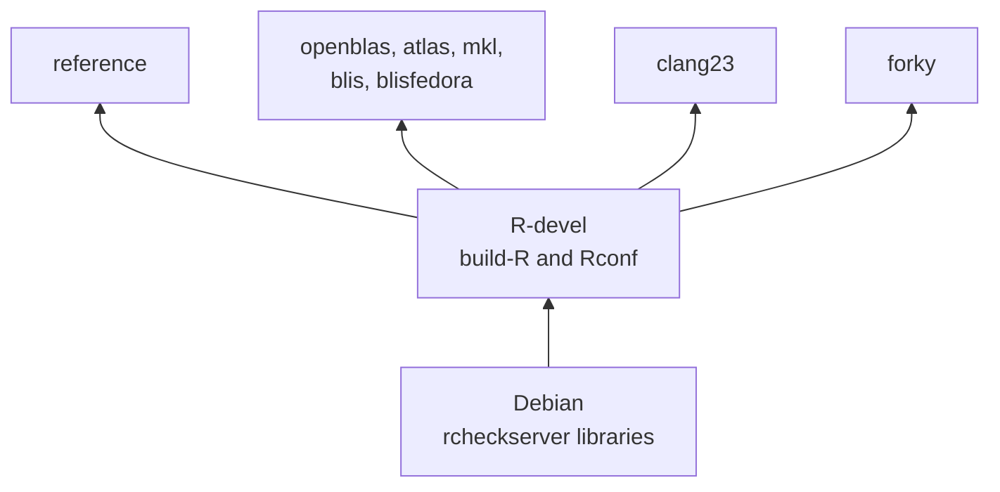
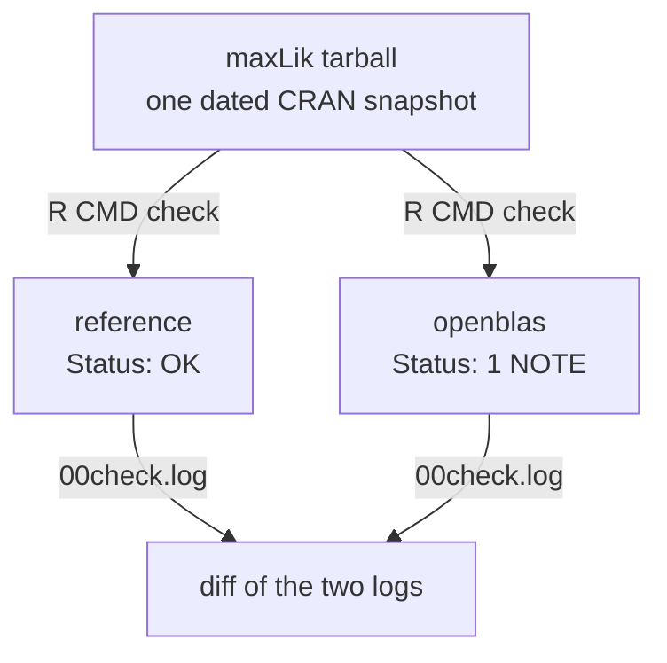

# r-check-containers

These containers rerun CRAN's additional BLAS and clang checks on your own
machine.

Each image is called an *arm*. An arm is R-devel built with `build-R` and
`Rconf` from the [CRAN QA tree][qa-tree], on a Debian base that gets its
system libraries from AASC's [`rcheckserver`][aasc]. An arm differs from the
`reference` arm in the BLAS, the compilers or the Debian release, so a
difference in a check result can be traced to that change.

This is a fork of Simon Urbanek's [docker-r-check][docker-r-check]. His
build-and-mount workflow, described in [README](README), works as before. The
fork adds the arms, a `standalone` image with R built in, the scripts in
`demo/`, and a workflow that compares the arms with CRAN's own results.

All arms share one R build recipe.



## Arms

There are eight arms. Each one changes a single thing against `reference`,
except `blisfedora`, which also needs a newer Debian for its BLIS.

| Arm | What it changes | Passed to `Rconf` |
|---|---|---|
| `reference` | Nothing. R's own BLAS and LAPACK, GCC 14, Debian trixie. | `-bi` |
| `openblas` | Serial OpenBLAS 0.3.29, with its LAPACK 3.12.0 | `-bo` |
| `atlas` | ATLAS 3.10.3, with its LAPACK 3.11.0 | `--with-blas=-lblas --with-lapack=-llapack` |
| `mkl` | Serial Intel MKL 2026.1, BLAS and LAPACK | `-bm` |
| `blis` | Serial BLIS 2.1, with Debian's LAPACK 3.12.1 | `--with-blas=-lblas --with-lapack=-llapack` |
| `blisfedora` | The BLIS binary from Fedora's `blis-2.0-5` package, which is the one CRAN uses, on Debian forky | `--with-blas=-lblas --with-lapack=-llapack` |
| `clang23` | clang 23 and flang 23, with libc++ | `-fc/23 -bi` |
| `forky` | Debian forky, which has glibc 2.43 | `-bi` |

`reference` is the control. All eight build on GitHub's x86 runners, and the
first three also build on a Mac under Rosetta. A build fails unless R reports
the BLAS the arm is named for, so an image cannot carry a different BLAS than
its name says.

CRAN's [list of issue kinds][issue-kinds] changes often. Regular ATLAS runs
stopped on 2026-09-01, according to the [notes on the BLAS checks][rblas],
and BLIS joined the list. You can fetch the current list in R.

```r
x <- readRDS(url("https://cran.r-project.org/web/checks/check_issues.rds"))
table(x$kind)
```

## How the arms compare with CRAN

A workflow checks every package on CRAN's current BLAS and clang23 lists in
the arm that matches its list and in `reference`, then compares each result
with CRAN's own log. On 2026-10-04 that was 109 packages.

| CRAN's list | Packages | What the arms showed |
|---|---|---|
| MKL | 3 | One real MKL failure, a segfault in the tests of `fastPLS`. It appears in `mkl` and not in `reference`. |
| BLIS | 6 | Four appear with Fedora's binary and two with Debian's BLIS. Which ones depends on the kernels BLIS uses for the CPU. |
| OpenBLAS | 3 | All three failed at CRAN on a web request, which is not an OpenBLAS problem. |
| clang23 | 97 | Three packages fail to compile, with the same compiler error as at CRAN. 83 pass, mostly because `duckdb`, which they need, builds again. |

Pushing a branch named `evaluate` starts a run, and `eval/run.env` says which
lists it covers. A full run keeps GitHub's runners busy for several hours.

## One package in two arms

`maxLik` 1.5-2.2 was on CRAN's OpenBLAS list on 2026-09-24 with one NOTE, a
line of `BFGSR.R` output that differs from the saved copy. The two arms agreed
with CRAN. `reference` was clean, and `openblas` gave the same NOTE as CRAN's
log, line for line.

`04-compare.sh` checks one tarball in both arms and diffs the two logs.



The two logs differ by one line of test output.

```
$ RCC_COMPARE_ONLY=1 demo/04-compare.sh "reference openblas" maxLik
maxLik
  reference    OK                           mode=regular
  openblas     1 NOTE                       mode=regular  openblas-core=Haswell
  reference vs openblas: 00check.log differs
    57c57
    < * checking tests ... OK
    ---
    > * checking tests ... NOTE
    59c59,63
    <   Comparing ‘BFGSR.Rout’ to ‘BFGSR.Rout.save’ ... OK
    ---
    >   Comparing ‘BFGSR.Rout’ to ‘BFGSR.Rout.save’ ...
    > 73c73
    > < [1] "Mean relative difference: 1"
    > ---
    > > [1] TRUE
    74c78
    < Status: OK
    ---
    > Status: 1 NOTE
```

I ran this on an M2 Max under Rosetta, with dependencies from the 2026-09-24
snapshot. Two settings affect the result, the OpenBLAS kernel and the check
mode.

OpenBLAS picks its kernel from the CPU. Under Rosetta it picks Nehalem, and
the NOTE does not appear. With the kernel pinned to Haswell or Zen, the NOTE
appears. Pin the kernel on any host whose results you want to compare.

The image's default mode is a submission check, which gives a WARNING for any
version already on CRAN. `base64enc` 0.1-6 is `Status: OK` in `regular` mode
and gets "Insufficient package version" in `incoming` mode. The demos default
to `regular`.

## Quick start

You need Docker with BuildKit, about 60 GB of free disk and 8 GB of engine
memory. The host can be x86_64 Linux or an Apple Silicon Mac. These commands
build two arms and compare them on `maxLik`.

```sh
demo/00-preflight.sh                     # can this host run amd64 images?
demo/01-build.sh reference openblas      # build two arms
demo/02-inspect.sh reference openblas    # which BLAS and LAPACK did R get?
OPENBLAS_CORETYPE=Haswell \
  demo/04-compare.sh "reference openblas" maxLik
```

Output goes to `results/`, which git ignores. The build downloads from Docker
Hub, deb.debian.org, statmath.wu.ac.at, svn.r-project.org and
cloud.r-project.org. The `mkl`, `clang23` and `blisfedora` arms also download
from Intel, apt.llvm.org and Fedora. Checks download from a CRAN mirror and
bioconductor.org.

## Demo scripts

The five scripts in `demo/` are thin wrappers around `docker build` and
`docker run`. They run in order, from checking the host to comparing two
arms.

| Script | What it does |
|---|---|
| `00-preflight.sh` | Confirms the engine can run amd64 containers and says whether they run natively, under Rosetta or under QEMU. |
| `01-build.sh <arm>...` | Builds `rcc-standalone:<arm>` with R and the QA tree pinned to fixed SVN revisions. |
| `02-inspect.sh <arm>...` | Prints what the image recorded at build time and the BLAS and LAPACK that R loads. |
| `03-check.sh <arm> <pkg>...` | Checks CRAN packages or local tarballs through the image's entrypoint. Writes the `.Rcheck` directory and a `manifest.dcf` to `results/<arm>/<pkg>/`. |
| `04-compare.sh "<arms>" <pkg>...` | Runs `03-check.sh` in each arm from one dated snapshot, then diffs every `00check.log` against the first arm's. |

A few environment variables change how the scripts behave.

| Variable | Effect |
|---|---|
| `RCC_MODE=regular` | The default. A plain `R CMD check`, like the runs behind CRAN's additional issues. |
| `RCC_MODE=incoming` | `R CMD check --as-cran` with the incoming checks a new submission gets. Needs a live CRAN mirror. |
| `CRAN_MIRROR` | Where dependencies come from. A dated [snapshot][p3m] makes two runs install the same versions. |
| `OPENBLAS_CORETYPE` | Pins the OpenBLAS kernel, the CPU-specific code it runs. |
| `BLIS_ARCH_TYPE` | Pins the BLIS kernel set in the same way, for example `haswell`. |
| `RCC_LIBRARY_CACHE=1` | Keeps installed dependencies in a Docker volume so the next run skips compiling them. |
| `RCC_COMPARE_ONLY=1` | Makes `04-compare.sh` compare earlier results without running the checks again. |
| `R_SVN_REV`, `QA_SVN_REV`, `RCC_JOBS` | The pinned revisions and the `make -j` level for `01-build.sh`. |

`03-check.sh` exits 0 when every package is clean, 1 when any is not (a NOTE
counts, as it does on CRAN) and 2 when a check did not finish. The container
runs as an unprivileged user with capabilities dropped. It keeps network
access because installing dependencies needs it.

## On my Apple Silicon Mac

I built and ran the `reference`, `openblas` and `atlas` arms on an M2 Max,
and everything in the `maxLik` example above. Docker Desktop runs
the amd64 images through Rosetta once "Use Rosetta for x86_64/amd64
emulation" is switched on in its [settings][docker-settings], and
`demo/00-preflight.sh` checks that setting before you start a long build. A
first build takes about an hour on my Mac, compared with 24 minutes on CI's
native x86 runner.

| Step | My M2 Max, Rosetta | CI, native x86 |
|---|---|---|
| First arm, from nothing | 65 min | 24 min |
| Each further arm | 23 min | 26 min |
| Checking `maxLik`, 151 dependencies | about 1 hour | |
| The same check with `RCC_LIBRARY_CACHE=1` | 2 min | |

About half of the first hour is downloading and unpacking `rcheckserver`,
which happens once. The second arm reuses the base and adds under 1 GB. With
the library cache on, repeating the `maxLik` check took two minutes because
its dependencies were already compiled. After two arms and a round of checks
my Docker Desktop VM used 56 GB of disk, which is why the quick start asks
for 60 GB.

My first `maxLik` run came back clean in both arms, because OpenBLAS under
Rosetta picks Nehalem. Setting `OPENBLAS_CORETYPE=Haswell` reproduced CRAN's
NOTE. AVX-512 kernels such as `SkylakeX` do not run under Rosetta at all.

I always pass `--platform linux/amd64`, as the demos do. Without it Docker
builds for arm64 and the base image stops with an error.

## Using Docker directly

The demos wrap two Docker commands, and you can run them yourself. The first
builds an arm from the repository root.

```sh
docker build --platform linux/amd64 --target standalone \
  --build-arg DEBIAN_TAG=trixie --build-arg RCC_FLAVOUR=openblas \
  --build-arg R_SVN_REV=90410 --build-arg QA_SVN_REV=6927 \
  --build-arg MAKEFLAGS=-j8 --build-arg BUILD_DATE="$(date -u +%Y-%m-%d)" \
  -t rcc-standalone:openblas docker/
```

The second checks every tarball in `./pkgs` as a regular check, then copies
the result out of the container.

```sh
docker run --platform linux/amd64 --name chk \
  -v "$PWD/pkgs:/pkg:ro" rcc-standalone:openblas -r
docker cp chk:/build/CRAN/mypkg.Rcheck ./ && docker rm chk
```

Arguments after the image name go to `check_CRAN_incoming`. Results are in
`/build/CRAN/<pkg>.Rcheck` inside the container. Do not mount anything over
`/build`, because R is installed there in the `standalone` image. Pass
`DEBIAN_TAG=trixie` explicitly, because the Dockerfile defaults to
`unstable`.

## Tests and CI

Two test scripts check the BLAS setup against real Debian packages, including
cases that should fail. Each runs in a fresh container.

```sh
docker run --rm --platform linux/amd64 -v "$PWD:/repo:ro" -w /repo \
  debian:trixie-slim bash tests/blas-wiring-test.sh
docker run --rm --platform linux/amd64 -v "$PWD:/repo:ro" -w /repo \
  debian:trixie-slim bash tests/flavour-test.sh
```

The [build workflow](.github/workflows/build.yml) runs both tests, builds the
base image, then builds each arm and runs `R CMD check` on `digest` and
`jsonlite` in it. That last step only confirms that a check runs to a
`Status:` line. The [evaluate workflow](.github/workflows/evaluate.yml) is
the comparison with CRAN described above, and it checks packages through the
images' entrypoint. Neither workflow publishes images. Both add swap on the
runner before a build, because exporting a finished image takes about 15 GB
of memory and a GitHub runner has 16.

## Caveats

The `atlas` arm differs from the others in its base. Debian trixie's
`liblapacke` conflicts with the [ATLAS][atlas] packages from bookworm, so I
remove `liblapacke`, `liblapacke-dev` and the `rcheckserver` metapackage in
that arm and link R with `-lblas -llapack`. CRAN no longer runs ATLAS checks
regularly, so there is little to compare this arm against.

The containers use the check settings from the QA tree, which are the ones
for incoming submissions. CRAN's BLAS checks run on Fedora with a different
locale, time zone and compiler. A result can therefore differ from CRAN's for
reasons unrelated to the BLAS, so I compare arms with each other first.

OpenBLAS and BLIS pick their kernels from the CPU, and the results change
with them. With Fedora's BLIS binary, `irlba` fails with one kernel set and
`lmeInfo` with another. GitHub's runners are a mix of AMD and Intel machines,
so the comparison pins the kernel set and records the CPU for every run.

`blisfedora` is not a pure Debian arm. It loads a Fedora binary that needs
glibc 2.43, so it builds on Debian forky. I keep it because it shows which of
CRAN's BLIS results come from Fedora's build of BLIS.

In the `clang23` arm a few packages cannot be checked. Debian builds its C++
system libraries with libstdc++, so `terra`, `pdftools` and the packages that
need them do not install with libc++. CRAN's machine has libc++ builds of
those libraries.

The image's entrypoint always exits 0, so `03-check.sh` reads the result from
`00check.log`.

Builds pin R-devel and the QA tree by SVN revision. Debian packages are not
pinned, and neither is clang 23, so two builds made a week apart can differ.

I have not yet published images or hardened the containers for untrusted
code. The check user still has passwordless `sudo`. The arms also apply only
to the `standalone` image, and the original build-and-mount workflow does not
use them yet.

## Layout

The image definitions are in `docker/`, and the scripts that use them are in
`demo/`, `eval/` and `tests/`.

```
docker/Dockerfile            base -> build-r -> pkgcheck -> standalone
docker/flavours/*.env        one file per arm with packages, pins and Rconf flags
docker/flavour-setup.sh      installs an arm's system packages, then selects the BLAS
docker/blas-wiring.sh        sets and verifies Debian's BLAS/LAPACK alternatives
docker/assert-r-blas.sh      fails the build unless R uses the arm's BLAS
docker/fetch-recommended.sh  fetches R's recommended packages over HTTPS
docker/entry-build-r.sh      runs build-R and fails if the build or make check does
docker/entry-pkgcheck.sh     the check entrypoint (check_CRAN_incoming -n)
demo/                        the scripts described above
eval/                        picks CRAN's current issues and writes the comparison
tests/                       tests for the BLAS setup, run in debian:trixie-slim
build-images.sh, build-R.sh, chk-pkgs.sh   the original host-mounted workflow
```

## License

The code this fork adds is licensed under GPL (>= 2), as R is.

## References

- [s-u/docker-r-check][docker-r-check], the repository this fork starts from
- [CRAN QA tree][qa-tree], home of `build-R`, `Rconf` and `check_CRAN_incoming`
- [AASC Debian archive][aasc], which serves `rcheckserver`
- [CRAN check issue kinds][issue-kinds] and the data behind them,
  [`check_issues.rds`][check-issues]
- [Brian Ripley's notes on the BLAS checks][rblas] and on the
  [clang23 checks][clang23-notes]
- [R Installation and Administration][r-admin], the section on linear algebra
- [Debian's tracker page for ATLAS][atlas]
- [Posit Package Manager][p3m], for dated CRAN snapshots
- [OpenBLAS][openblas], [BLIS][blis] and [Intel MKL][mkl]
- [Fedora's `blis` package][fedora-blis], the source of the `blisfedora` binary
- [apt.llvm.org][apt-llvm], the source of clang 23 and flang 23
- [Docker Desktop settings][docker-settings], for the Rosetta switch

[docker-r-check]: https://github.com/s-u/docker-r-check
[qa-tree]: https://svn.r-project.org/R-dev-web/trunk/CRAN/QA/
[aasc]: https://statmath.wu.ac.at/AASC/debian/
[issue-kinds]: https://cran.r-project.org/web/checks/check_issue_kinds.html
[check-issues]: https://cran.r-project.org/web/checks/check_issues.rds
[rblas]: https://www.stats.ox.ac.uk/pub/bdr/Rblas/README.txt
[clang23-notes]: https://www.stats.ox.ac.uk/pub/bdr/clang23/README.txt
[r-admin]: https://cran.r-project.org/doc/manuals/r-devel/R-admin.html#Linear-algebra
[atlas]: https://tracker.debian.org/pkg/atlas
[p3m]: https://packagemanager.posit.co/client/#/repos/cran/setup
[openblas]: https://github.com/OpenMathLib/OpenBLAS
[blis]: https://github.com/flame/blis
[mkl]: https://www.intel.com/content/www/us/en/developer/tools/oneapi/onemkl.html
[fedora-blis]: https://src.fedoraproject.org/rpms/blis
[apt-llvm]: https://apt.llvm.org/
[docker-settings]: https://docs.docker.com/desktop/settings-and-maintenance/settings/
